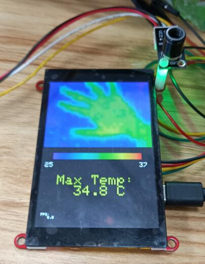
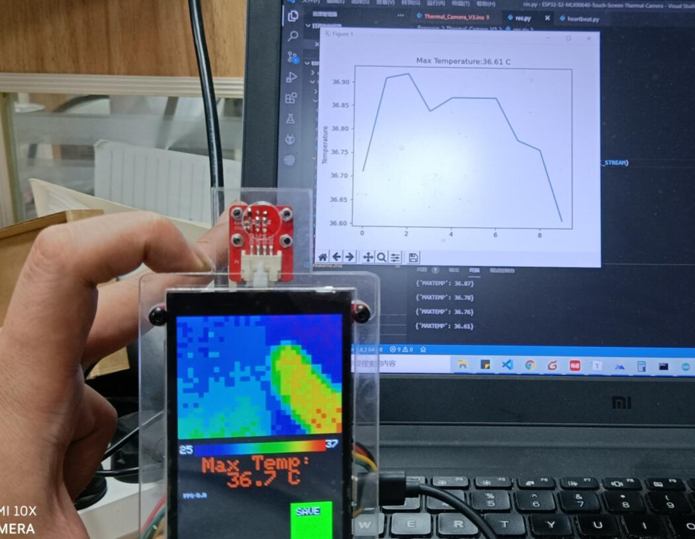
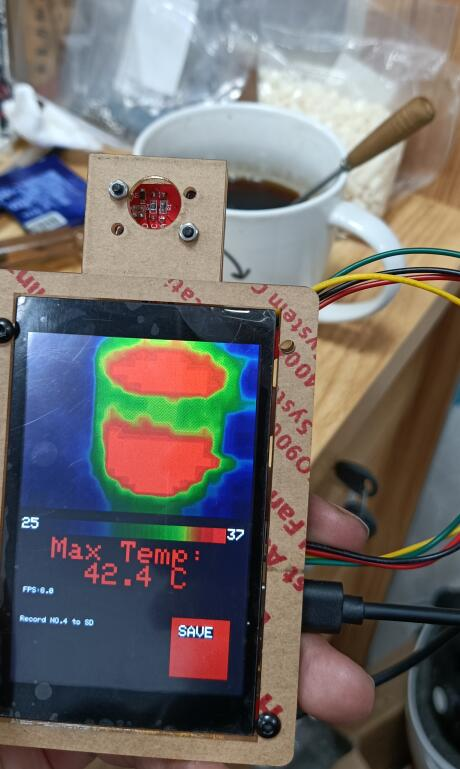

# ESP32-S3 MLX90640 Touch Screen Thermal Camera 

```c++
/*
Version:		V3.2
Author:			Vincent
Create Date:	2021/12/3
Note:
	2024/1/8	V3.2: The S2 has been discontinued, and all tests under the S3 have passed.
				V3.1: Added the function of shielding bad spots
	2021/12/31	V3.0: Add Wifi mode,can display on a python program.
	2021/12/22	V2.0: Added a modular kit and has an acrylic case.
	
*/
```



[toc]

# Makerfabs

[Makerfabs home page](https://www.makerfabs.com/)

[Makerfabs Wiki](https://wiki.makerfabs.com/)

# ESP32-S2 MLX90640 Touch Screen Thermal Camera
## Intruduce

Product Link ：[]() 

Wiki Link : []() 

Based on Makefabs ESP32-S3 Parallel TFT, Mabee MLX90640(Thermal imaging camera). This is a thermal imaging camera kit, contains a laser-cut acrylic case. 

It can realize non-contact remote temperature measurement and fault detection. The advantage is that it is simple and intuitive, showing temperature differences across the entire region. It can also detect the movement of living things with no light at all.

Or just checking the temperature of your coffee.


# Item List

- [Makerfabs ESP32-S2 Parallel TFT with Touch](https://www.makerfabs.com/esp32-s3-parallel-tft-with-touch-ili9488.html)
- [Mabee MLX90640](https://www.makerfabs.com/mabee-mlx90640.html)


### Front:


### Back:


# Code


## Compiler Options

**If you have any questions，such as how to install the development board, how to download the code, how to install the library. Please refer to :[Makerfabs_FAQ](https://github.com/Makerfabs/Makerfabs_FAQ)**

- Install board : ESP32

```

Using 1.1.9  Version LovyanGFX    LovyanGFX 
Using 2.0.0  Version Wire    esp32\2.0.11\libraries\Wire 
Using 1.0.4  Version Adafruit_MLX90640    Adafruit_MLX90640 
Using 1.14.4  Version Adafruit_BusIO    Adafruit_BusIO 
Using 2.0.0  Version FS    esp32\2.0.11\libraries\FS 
Using 2.0.0  Version SD    esp32\2.0.11\libraries\SD 
Using 2.0.0  Version SPI    esp32\2.0.11\libraries\SPI 


```

For detailed burning method, please refer to [Makerfabs-ESP32-S3-Parallel-TFT-with-Touch](https://github.com/Makerfabs/Makerfabs-ESP32-S3-Parallel-TFT-with-Touch)

## Firmware

### Thermal_Camera S3

The S2 has been discontinued, and all tests under the S3 have passed.

### Thermal_Camera V3

Add a python display, without interporation.

Run rec.py

And need uncommitted WIFI_MODE.

```c++
//Choice local mode or wifi mode
#define WIFI_MODE
```




### Thermal_Camera V2

Based on ESP32-S2, ILI9488 screen, ft6236 touch drive, MLX90640 sensor is a thermal imaging camera demo. 

Temperature images can be displayed on the screen.  The highest temperature in the range will be displayed. 

Data can be stored to an SD card by pressing buttons on the touch screen.

Added macro definition of camera orientation, which can be combined with the hole in the acrylic case to choose whether the camera faces the screen or the other side



If you want change MLX90640 direction. Default is 1.

```c++
#define MLX_MIRROR 0 // Set 1 when the camera is facing the screen
```


### Thermal_Camera

Based on ESP32-S2, ILI9488 screen, ft6236 touch drive, MLX90640 sensor is a thermal imaging camera demo. 

Temperature images can be displayed on the screen.


## Example

### MLX1

Simply obtain the temperature matrix of MLX90640 transmission. And  display via serial port.

